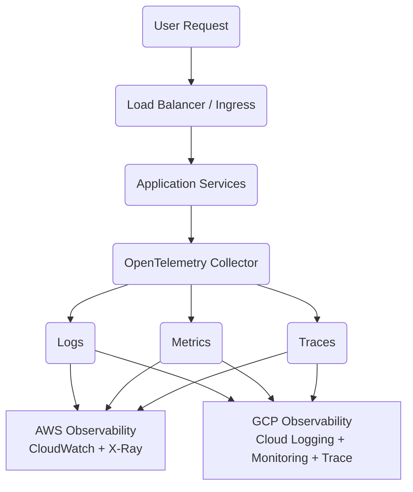
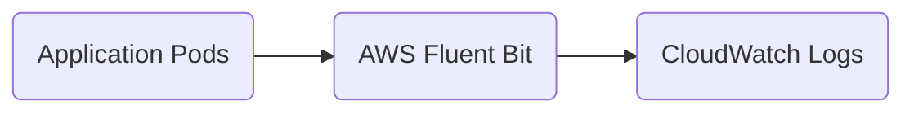
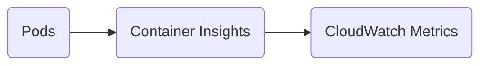
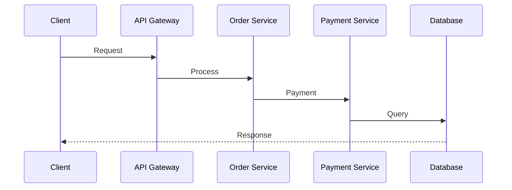
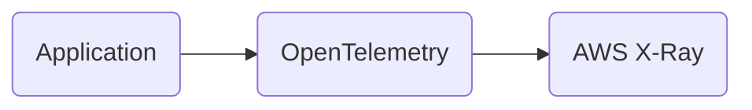
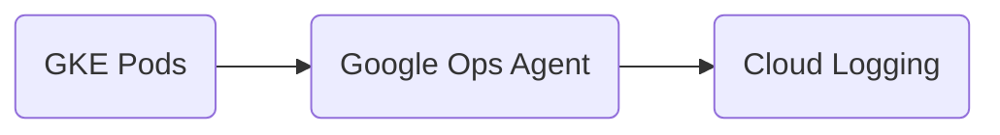
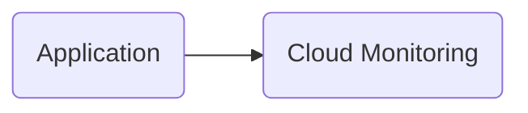
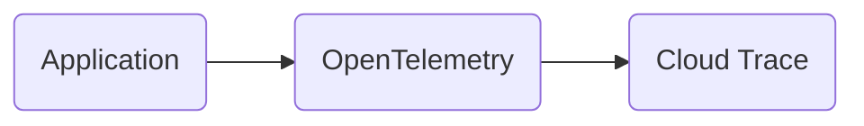
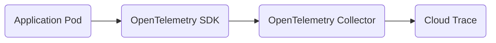
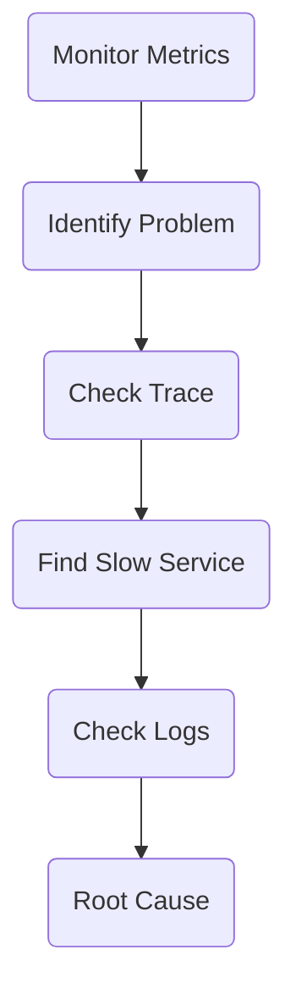

# 🌐 Cloud Observability Setup Guide

## AWS (Amazon Web Services) & GCP (Google Cloud Platform)

<p align="center">


</p>

> A complete reference guide for implementing **full-stack observability** across cloud infrastructure, Kubernetes clusters, microservices, virtual machines, and serverless applications.

---

# 📌 Overview

Modern cloud applications require visibility into:

- Application health
- Infrastructure performance
- User request flow
- Failures and errors
- Service dependencies
- Performance bottlenecks

Observability provides this visibility through three major pillars:

| Pillar | Question Answered | Purpose |
|---|---|---|
| 📜 Logs | What happened? | Records events and errors |
| 📈 Metrics | How is the system performing? | Measures system health |
| 🔍 Traces | Where did the request go? | Tracks request journey |

---

# 🏗️ Observability Architecture

## High-Level Multi-Cloud Architecture



---

# ☁️ AWS Observability

AWS provides observability through:

| Signal | AWS Service |
|-|-|
| 📜 Logs | CloudWatch Logs |
| 📈 Metrics | CloudWatch Metrics |
| 🔍 Traces | AWS X-Ray |
| 📊 Dashboard | CloudWatch Dashboard |
| 🚨 Alerts | CloudWatch Alarms |

---

# 1. AWS Logs

## Service

Amazon CloudWatch Logs

## Supported Services

- Amazon EKS
- Amazon ECS
- EC2
- Lambda


## AWS EKS Logging Architecture



---

## EC2 Logging

Install:

```
CloudWatch Agent
```

Collect logs:

```
/var/log/messages

/var/log/syslog

/var/log/nginx/access.log

/var/log/nginx/error.log
```

---

## Lambda Logging

No additional setup required.

Lambda automatically sends execution logs:

```
Lambda
   |
   |
CloudWatch Logs
```

---

## Verification

AWS Console:

```
CloudWatch

     ↓

Log Groups
```

Verify:

✅ Application Logs  
✅ Error Logs  
✅ Startup Logs  
✅ Request Logs  

---

# 2. AWS Metrics

## Service

Amazon CloudWatch Metrics


AWS automatically provides metrics for:

- EC2
- RDS
- Lambda
- ELB
- S3
- DynamoDB


## EKS Metrics Architecture




## Important Metrics

| Infrastructure | Application |
|-|-|
| CPU Usage | Request Count |
| Memory Usage | Response Time |
| Disk Usage | Error Rate |
| Network Traffic | Pod Restart |
| | Pod CPU / Memory |

---

# 3. AWS Distributed Tracing

## Service

AWS X-Ray


Tracing helps identify:

- Slow services
- Failed requests
- Dependency issues
- Performance bottlenecks


## Request Flow




## Enable Tracing

Use:

- OpenTelemetry SDK
- AWS X-Ray SDK
- OpenTelemetry Java Agent


Architecture:




## Verify

AWS Console:

```
CloudWatch

      ↓

Application Signals

      OR

AWS X-Ray
```

Check:

- Trace ID
- Duration
- Service Map
- Errors
- Slow Spans

---

# ☁️ GCP Observability

Google Cloud Operations Suite provides:

| Signal | GCP Service |
|-|-|
| 📜 Logs | Cloud Logging |
| 📈 Metrics | Cloud Monitoring |
| 🔍 Traces | Cloud Trace |
| 📊 Dashboard | Monitoring Dashboard |
| 🚨 Alerts | Alert Policies |

---

# 4. GCP Logs

## Service

Cloud Logging


Supported:

- GKE
- Compute Engine
- Cloud Run
- App Engine


Architecture:




## Verification

Google Console:

```
Observability

      ↓

Logs Explorer
```

Check:

✅ Application Logs  
✅ HTTP Logs  
✅ Error Logs  
✅ Startup Logs  

---

# 5. GCP Metrics

## Service

Cloud Monitoring


Metrics:

| Infrastructure | Application |
|-|-|
| CPU | Request Count |
| Memory | Error Rate |
| Disk | Latency |
| Network | Pod Restart |

---

Architecture:



---

# 6. GCP Distributed Tracing

## Service

Cloud Trace


> Cloud Trace requires application instrumentation.

Required:

- OpenTelemetry SDK
- OpenTelemetry Agent
- OpenTelemetry Collector


Architecture:



---

## GKE Trace Flow



---

## Verification

Google Console:

```
Observability

       ↓

Trace Explorer
```

Check:

- Trace ID
- Span ID
- Service Name
- Latency
- Errors

---

# 📊 Logs vs Metrics vs Traces

| Feature | Logs | Metrics | Traces |
|-|-|-|-|
| Purpose | Events | Performance | Request Flow |
| Data Type | Text | Numbers | Timeline |
| Best For | Debugging | Monitoring | Bottleneck Analysis |
| Example | Error Message | CPU 90% | Slow API Call |

---

# ⚖️ Advantages & Disadvantages

## Logs

### Advantages

✅ Detailed history  
✅ Error investigation  
✅ Security auditing  
✅ Root cause analysis  


### Disadvantages

❌ Storage cost  
❌ Large volume management  
❌ Retention planning required  


---

## Metrics

### Advantages

✅ Real-time monitoring  
✅ Dashboards  
✅ Alerts  
✅ Capacity planning  


### Disadvantages

❌ Cannot explain exact issue  
❌ Custom metrics cost  


---

## Traces

### Advantages

✅ End-to-end visibility  
✅ Microservice troubleshooting  
✅ Latency analysis  


### Disadvantages

❌ Requires instrumentation  
❌ Additional setup  
❌ Sampling limitations  

---

# AWS vs GCP Comparison

| Feature | AWS | GCP |
|-|-|-|
| Logs | CloudWatch Logs | Cloud Logging |
| Metrics | CloudWatch Metrics | Cloud Monitoring |
| Traces | AWS X-Ray | Cloud Trace |
| Dashboards | CloudWatch Dashboard | Monitoring Dashboard |
| Alerts | CloudWatch Alarm | Alert Policy |
| OpenTelemetry | Supported | Supported |

---

# ✅ Monitoring Checklist

## AWS

- [ ] CloudWatch Logs Enabled
- [ ] CloudWatch Metrics Enabled
- [ ] Container Insights Enabled
- [ ] CloudWatch Agent Installed
- [ ] AWS X-Ray Enabled
- [ ] OpenTelemetry Configured
- [ ] Dashboards Created
- [ ] Alerts Configured


## GCP

- [ ] Cloud Logging Enabled
- [ ] Cloud Monitoring Enabled
- [ ] Cloud Trace Enabled
- [ ] OpenTelemetry Configured
- [ ] Dashboards Created
- [ ] Alert Policies Created

---

# 🔄 Recommended Troubleshooting Flow



---

# 📂 Repository Structure

```
cloud-observability-docs/

│
├── README.md
│
├── aws/
│   ├── logs.md
│   ├── metrics.md
│   ├── traces.md
│
├── gcp/
│   ├── logging.md
│   ├── monitoring.md
│   ├── tracing.md
│
├── kubernetes/
│   ├── eks.md
│   ├── gke.md
│   └── opentelemetry.md
│
├── diagrams/
│
└── troubleshooting/
```

---

# 🎯 Goal

This repository provides a practical guide for implementing enterprise-grade observability using:

- AWS
- GCP
- Kubernetes
- OpenTelemetry
- Cloud Monitoring Tools


---

# 🤝 Contribution

Contributions and improvements are welcome.

Create an issue or submit a pull request.

---

# 📄 License

Documentation project for learning and operational reference.
